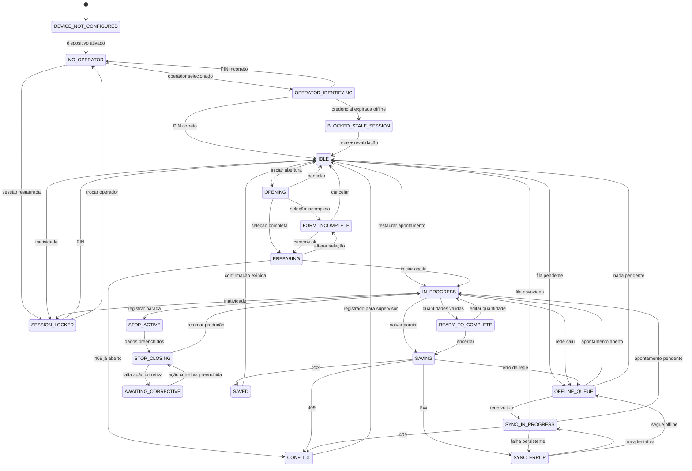
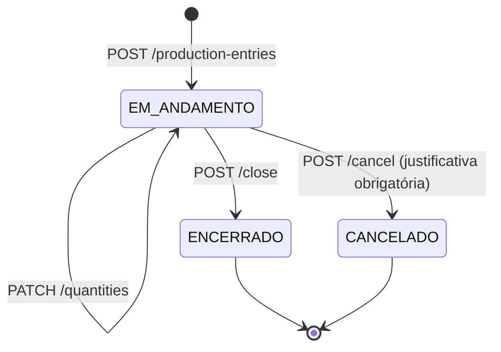
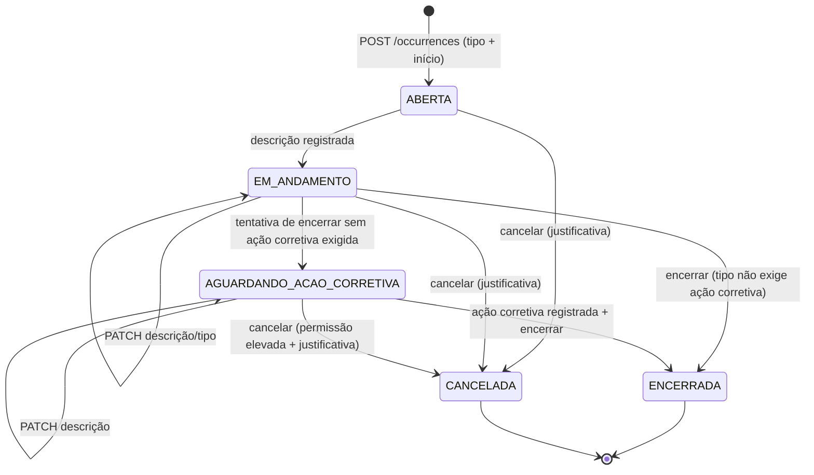

# Máquinas de estado — apontamento e ocorrência

**Status:** planejamento técnico. Nenhum código foi criado a partir deste documento.

Cobre as Fases 2 e 3 de [plano-fases-2-a-6.md](plano-fases-2-a-6.md). São **duas**
máquinas distintas em dois lugares distintos, e confundi-las é o erro mais provável desta
implementação:

| Máquina | Onde vive | O que representa | Persistência |
|---|---|---|---|
| **Sessão do posto** (17 → 21 estados) | Frontend, `frontend/src/store/session.store.ts` | O que a tela do tablet está fazendo agora | `sessionStorage` (device/queueCount) + IndexedDB (dados) |
| **Apontamento** (3 status) | Backend, `apontamento.status` | O ciclo de vida do registro de negócio | PostgreSQL |
| **Ocorrência** (5 status) | Backend, `ocorrencia.status` | O ciclo de vida da parada | PostgreSQL |

A máquina do frontend é rica (reflete telas e conectividade); a do backend é mínima e
auditável. O frontend **nunca** infere o status do servidor a partir do seu próprio
estado — ele lê o status retornado pela API.

---

## 1. Máquina da sessão do posto (frontend) — extensão da existente

### 1.1 O que já existe (não recriar)

`frontend/src/store/session.store.ts` já define 16 estados no tipo `SessionState`
(documentados como "17 estados" em [interface.md](interface.md), contando `NEW_VERSION`
como sobreposto) e um grafo `VALID_TRANSITIONS` com validação em `transitionTo()`:
transição inválida é rejeitada com `console.error` e **não** altera o estado.

Estados atuais: `DEVICE_NOT_CONFIGURED`, `NO_OPERATOR`, `SESSION_LOCKED`, `IDLE`,
`FORM_INCOMPLETE`, `PREPARING`, `IN_PROGRESS`, `STOP_ACTIVE`, `AWAITING_CORRECTIVE`,
`READY_TO_COMPLETE`, `SAVING`, `SAVED`, `OFFLINE_QUEUE`, `SYNC_ERROR`, `CONFLICT`,
`NEW_VERSION`.

**A extensão preserva todos eles com o mesmo nome e o mesmo significado.** Nenhum
estado é renomeado ou removido — os testes existentes em `session.store.test.ts` devem
continuar passando sem alteração de asserção.

### 1.2 Estados acrescentados

| Estado novo | Fase | Motivo |
|---|---|---|
| `OPERATOR_IDENTIFYING` | 2 | Entre `NO_OPERATOR` e `IDLE`: operador selecionado, digitando PIN. Hoje esse passo não tem estado e a tela improvisa. |
| `OPENING` | 2 | Tela `/posto/abertura` (escolha de operação/O.P./lote). Hoje `FORM_INCOMPLETE` acumula dois significados diferentes. |
| `STOP_CLOSING` | 3 | Parada com dados preenchidos, aguardando confirmação de retomada — distingue "digitando ação corretiva" de "parada pendente sem ação". |
| `SYNC_IN_PROGRESS` | 4 | Fila sendo esvaziada; distingue de `SAVING` (envio de um registro específico). |
| `BLOCKED_STALE_SESSION` | 4 | Sessão de operador em cache expirou offline: bloqueia a operação sem inventar sessão falsa (regra 5.4 da Fase 4). |

Total: 21 estados (20 sequenciais + `NEW_VERSION` sobreposto).

### 1.3 Grafo completo (texto)

```
DEVICE_NOT_CONFIGURED
  └─ dispositivo ativado ──────────────────────► NO_OPERATOR

NO_OPERATOR
  ├─ operador selecionado ─────────────────────► OPERATOR_IDENTIFYING
  └─ sessão em cache restaurada ───────────────► SESSION_LOCKED

OPERATOR_IDENTIFYING
  ├─ PIN correto ──────────────────────────────► IDLE
  ├─ PIN incorreto / cancelado ────────────────► NO_OPERATOR
  └─ credencial local expirada (offline) ──────► BLOCKED_STALE_SESSION

SESSION_LOCKED
  ├─ PIN do mesmo operador ────────────────────► IDLE
  └─ trocar operador ──────────────────────────► NO_OPERATOR

BLOCKED_STALE_SESSION
  └─ rede voltou e login revalidado ───────────► IDLE
  (nenhuma outra saída: não existe desbloqueio offline)

IDLE
  ├─ iniciar abertura ─────────────────────────► OPENING
  ├─ apontamento aberto restaurado do IndexedDB ► IN_PROGRESS
  ├─ inatividade 5 min ────────────────────────► SESSION_LOCKED
  ├─ trocar operador ──────────────────────────► NO_OPERATOR
  └─ fila com pendências ──────────────────────► OFFLINE_QUEUE

OPENING
  ├─ seleção incompleta ───────────────────────► FORM_INCOMPLETE
  ├─ seleção completa ─────────────────────────► PREPARING
  ├─ cancelar ─────────────────────────────────► IDLE
  └─ inatividade ──────────────────────────────► SESSION_LOCKED

FORM_INCOMPLETE
  ├─ campos obrigatórios preenchidos ──────────► PREPARING
  ├─ cancelar ─────────────────────────────────► IDLE
  └─ inatividade ──────────────────────────────► SESSION_LOCKED

PREPARING
  ├─ "Iniciar apontamento" aceito (201/200) ───► IN_PROGRESS
  ├─ alterar seleção ──────────────────────────► FORM_INCOMPLETE
  ├─ 409 apontamento já aberto na máquina ─────► CONFLICT
  └─ inatividade ──────────────────────────────► SESSION_LOCKED

IN_PROGRESS
  ├─ "Registrar parada" ───────────────────────► STOP_ACTIVE
  ├─ quantidades válidas informadas ───────────► READY_TO_COMPLETE
  ├─ "Salvar parcial" ─────────────────────────► SAVING
  ├─ inatividade ──────────────────────────────► SESSION_LOCKED
  └─ rede caiu ────────────────────────────────► OFFLINE_QUEUE (apontamento continua)

STOP_ACTIVE
  ├─ descrição + (ação corretiva quando exigida) ► STOP_CLOSING
  ├─ tipo não exige ação corretiva ────────────► STOP_CLOSING
  └─ inatividade ──────────────────────────────► SESSION_LOCKED

STOP_CLOSING
  ├─ "Retomar produção" aceito ────────────────► IN_PROGRESS
  ├─ ação corretiva ausente e exigida ─────────► AWAITING_CORRECTIVE
  └─ inatividade ──────────────────────────────► SESSION_LOCKED

AWAITING_CORRECTIVE
  ├─ ação corretiva preenchida ────────────────► STOP_CLOSING
  └─ inatividade ──────────────────────────────► SESSION_LOCKED
  (não existe transição direta para IN_PROGRESS)

READY_TO_COMPLETE
  ├─ "Encerrar apontamento" ───────────────────► SAVING
  ├─ editar quantidade ────────────────────────► IN_PROGRESS
  └─ inatividade ──────────────────────────────► SESSION_LOCKED

SAVING
  ├─ 2xx ──────────────────────────────────────► SAVED
  ├─ 409 versão/duplicidade ───────────────────► CONFLICT
  ├─ erro de rede ─────────────────────────────► OFFLINE_QUEUE
  └─ erro 5xx ─────────────────────────────────► SYNC_ERROR

SAVED
  └─ após confirmação visual (2,5 s) ──────────► IDLE

OFFLINE_QUEUE
  ├─ rede voltou ──────────────────────────────► SYNC_IN_PROGRESS
  ├─ apontamento local ainda aberto ───────────► IN_PROGRESS
  └─ nada pendente ────────────────────────────► IDLE

SYNC_IN_PROGRESS
  ├─ fila esvaziada ───────────────────────────► IDLE
  ├─ apontamento aberto pendente ──────────────► IN_PROGRESS
  ├─ 409 em algum item ────────────────────────► CONFLICT
  └─ falha persistente ────────────────────────► SYNC_ERROR

SYNC_ERROR
  ├─ nova tentativa ───────────────────────────► SYNC_IN_PROGRESS
  └─ segue offline ────────────────────────────► OFFLINE_QUEUE

CONFLICT
  └─ conflito registrado para o supervisor ────► IDLE
  (o operador nunca resolve conflito na tela do posto)

NEW_VERSION — sobreposto: não é destino de transição; liga a flag
newVersionAvailable e coexiste com qualquer estado. Nunca aplica a atualização
automaticamente com apontamento aberto.
```

### 1.4 Diagrama



### 1.5 Transições explicitamente inválidas (devem ser testadas como rejeição)

| De | Para | Por quê |
|---|---|---|
| `AWAITING_CORRECTIVE` | `IN_PROGRESS` | Retomar produção sem ação corretiva é a regra central da Fase 3 |
| `AWAITING_CORRECTIVE` | `SAVING` | Encerrar apontamento com parada pendente |
| `IN_PROGRESS` | `IDLE` | Apontamento aberto nunca some sem encerrar ou cancelar |
| `NO_OPERATOR` | `IN_PROGRESS` | Apontamento sem operador identificado |
| `DEVICE_NOT_CONFIGURED` | qualquer coisa que não seja `NO_OPERATOR` | Tablet não ativado não opera |
| `BLOCKED_STALE_SESSION` | `IDLE` sem revalidação de rede | Sessão falsa offline |
| `CONFLICT` | `IN_PROGRESS` | Operador não resolve conflito |
| `SAVED` | `SAVING` | Reenvio duplicado |
| `SESSION_LOCKED` | `IN_PROGRESS` | Precisa passar por `IDLE` (que restaura o apontamento) |

Comportamento em transição inválida: **estado não muda**, erro é logado, e — mudança em
relação ao comportamento atual — a rejeição também é reportada por um callback
observável para que os testes possam asseverar sem depender de espionar `console.error`.

### 1.6 Regras invariantes da máquina do frontend

1. Nenhuma transição apaga o apontamento persistido no IndexedDB. Trocar operador,
   bloquear por inatividade e recarregar a página preservam `activeAppointment`.
2. `SESSION_LOCKED` é alcançável de qualquer estado operacional (`IDLE` em diante) por
   inatividade, e a volta é sempre por `IDLE`, que reconstrói o estado a partir do
   IndexedDB — nunca "pula" direto para `IN_PROGRESS`.
3. `NEW_VERSION` nunca interrompe apontamento aberto.
4. O estado é reconstruído no boot a partir do IndexedDB, não do `sessionStorage`
   (`partialize` persiste só `device` e `queueCount` — isso permanece).

---

## 2. Máquina do apontamento (backend)

`apontamento.status ∈ { EM_ANDAMENTO, ENCERRADO, CANCELADO }`.



| Evento | Pré-condições | Efeitos |
|---|---|---|
| `abrir` | máquina sem apontamento aberto (garantido pelo `EXCLUDE`); configuração item/molde vigente existe; lote disponível quando a operação consome resina; operador ativo; `Idempotency-Key` presente | grava snapshot de peso/cavidades/ciclo/limite; `inicio = now()` do servidor (ou `inicio` local quando offline, com `recebido_em` registrado); evento `ABERTO` |
| `atualizarQuantidades` | status `EM_ANDAMENTO`; valores `>= 0` | recalcula colunas geradas; evento `QUANTIDADE_ATUALIZADA` |
| `encerrar` | status `EM_ANDAMENTO`; `fim > inicio`; nenhuma ocorrência vinculada não encerrada (Fase 3); quantidades presentes | `fim`, status `ENCERRADO`, evento `ENCERRADO`, disparo do consumo de estoque (Fase 5) |
| `cancelar` | status `EM_ANDAMENTO`; justificativa não vazia; permissão `producao.apontamento.cancelar` | status `CANCELADO` (sai do `EXCLUDE`, liberando a máquina); evento `CANCELADO` |

**Transições inválidas** (retornam `409` com mensagem de negócio, nunca `500`):
`ENCERRADO → *`, `CANCELADO → *`, `encerrar` sem `fim`, `cancelar` sem justificativa,
`abrir` com máquina já ocupada, `atualizarQuantidades` em apontamento encerrado.

Reabertura de apontamento encerrado **não existe** nesta modelagem. Correção posterior é
um apontamento novo com `origem = 'AJUSTE'` referenciando o original (backlog da Fase 6).
O evento `REABERTO` está previsto no enum de `apontamento_evento` apenas para não exigir
migration quando/se essa decisão mudar — **não deve ser emitido** enquanto a reabertura
não for especificada.

---

## 3. Máquina da ocorrência/parada (backend)

`ocorrencia.status ∈ { ABERTA, EM_ANDAMENTO, AGUARDANDO_ACAO_CORRETIVA, ENCERRADA,
CANCELADA }`.



| Evento | Pré-condições | Efeitos |
|---|---|---|
| `abrir` | máquina sem ocorrência aberta (`EXCLUDE`); tipo ativo; `Idempotency-Key` | congela `planejada` e `exige_acao_corretiva_aplicado`; `inicio`; status `ABERTA`; evento `ABERTA`. O cronômetro do posto passa a contar a partir de `inicio` |
| `descrever` | status `ABERTA`/`EM_ANDAMENTO`/`AGUARDANDO_ACAO_CORRETIVA` | grava `descricao`; se vinha de `ABERTA`, vai para `EM_ANDAMENTO` |
| `registrarAcaoCorretiva` | status `EM_ANDAMENTO` ou `AGUARDANDO_ACAO_CORRETIVA`; texto não vazio | grava `acao_corretiva` |
| `encerrar` | status `EM_ANDAMENTO` ou `AGUARDANDO_ACAO_CORRETIVA`; `fim > inicio`; `acao_corretiva` presente quando exigida | `fim`, status `ENCERRADA`; libera o apontamento para encerrar |
| `cancelar` | status ≠ `ENCERRADA`; justificativa; permissão `producao.ocorrencia.cancelar` | status `CANCELADA`, sai do `EXCLUDE` |

`AGUARDANDO_ACAO_CORRETIVA` é um estado **real e persistido**, não um erro transitório:
é ele que sustenta o alerta "1 sem ação corretiva" do painel do dia e o bloqueio de
fechamento de turno. O `CHECK` de banco (Fase 3, seção 2) garante que `ENCERRADA` sem
ação corretiva é impossível mesmo por SQL direto.

**Transições inválidas** (`409` com mensagem controlada): `ENCERRADA → *`,
`CANCELADA → *`, `ABERTA → ENCERRADA` (sempre passa por `EM_ANDAMENTO`, porque descrição
é obrigatória), `encerrar` sem ação corretiva quando exigida, abrir segunda ocorrência
sobreposta na mesma máquina.

---

## 4. Cronômetro persistente (regra transversal)

Vale para o tempo de apontamento e para o tempo de parada.

1. A fonte da verdade é o **timestamp absoluto** (`inicio`), persistido no IndexedDB no
   mesmo momento em que a operação é enfileirada/enviada — nunca um contador acumulado.
2. A exibição é `agora − inicio`, recalculada a cada segundo por `setInterval`, que serve
   apenas para redesenhar. Se o `setInterval` morrer (aba suspensa, tablet dormindo), o
   valor volta correto no próximo tick.
3. Sobrevive a: reload da página, troca de operador, bloqueio por inatividade,
   fechamento e reabertura do app, e atualização do service worker.
4. Ao reconectar, se o servidor devolver um `inicio` diferente do local (caso de
   apontamento aberto offline e aceito com timestamp do servidor), **o valor do servidor
   prevalece** e o cronômetro salta — o salto é registrado no log, nunca escondido.
5. O tempo total de parada de um apontamento é sempre recalculado a partir das
   ocorrências no banco (`sum(fim − inicio)`), nunca de um acumulador mantido no cliente.
6. Meia-noite, virada de turno e horário de verão não afetam o cálculo porque tudo é
   `timestamptz`; nenhuma parte do cálculo pode usar hora local formatada.

---

## 5. Testes obrigatórios das máquinas

**Frontend (Vitest, `session.store.test.ts` estendido):**
- Toda transição válida da seção 1.3 muda o estado.
- Toda transição da tabela 1.5 não muda o estado e reporta rejeição.
- Os testes existentes da Fase 0/1 continuam passando sem alteração de asserção.
- `activeAppointment` persiste através de `SESSION_LOCKED → IDLE` e de
  `IDLE → NO_OPERATOR → OPERATOR_IDENTIFYING → IDLE`.
- `NEW_VERSION` não altera `state`.

**Backend (Jest):**
- Tabela de transições do apontamento e da ocorrência, uma asserção por linha.
- Toda transição inválida produz erro de negócio tipado (`409`), nunca exceção genérica.
- Congelamento: alterar `tipo_ocorrencia.planejada` depois não muda a ocorrência aberta.
- Encerrar apontamento com ocorrência em `AGUARDANDO_ACAO_CORRETIVA` → `409`.

# Atualizacao Fase 2 - 2026-08-01

O backend persiste apontamentos nos estados `rascunho`, `em_andamento`, `concluido` e `cancelado`. A tela operacional implementa o fluxo visual basico de login operacional por matricula/PIN, abertura com selecao de contexto e execucao com quantidades, perdas e conclusao.

A maquina visual ainda nao cobre offline/sync, conflitos e ocorrencias; esses pontos permanecem para fases posteriores.
